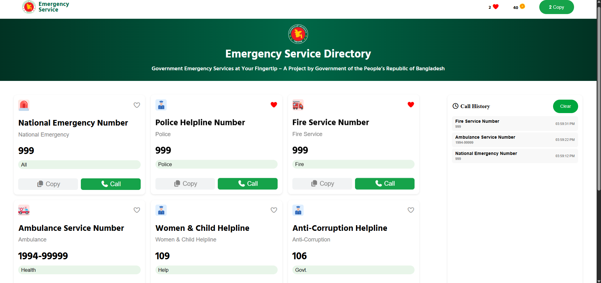

# 🌐 Live Site Link

- [Emergency Service Webpage](https://taoshif1.github.io/PH-A5/)


---

# 💡 JavaScript Core Concepts Explained  

Here are the answers to the essential JavaScript questions, detailing fundamental concepts used in building interactive web experiences like this project.  

---

## 1. What is the difference between `getElementById`, `getElementsByClassName` and `querySelector / querySelectorAll`?  

**Answer:**  

The difference lies in their **selection methods, return values and performance. The modern `querySelector` and `querySelectorAll` are more flexible and use CSS selectors, while the older `getElementById` and `getElementsByClassName` are specialized and generally faster for their specific use cases.**.  

- **`getElementById("id")`** → Selects a single element by its unique ID. Fastest for IDs.  
- **`getElementsByClassName("class")`** → Selects multiple elements with the same class. Returns a **live HTMLCollection**.  
- **`querySelector("cssSelector")`** → Selects the **first element** matching a CSS selector.  
- **`querySelectorAll("cssSelector")`** → Selects **all elements** matching a CSS selector. Returns a **static NodeList**.  

✅ Modern `querySelector` & `querySelectorAll` are more **flexible** (CSS-based), while `getElementById` and `getElementsByClassName` are **specialized & faster** for their cases.  

---

## 2. How do you create and insert a new element into the DOM?  

**Answer:**  

To create and insert a new element into the DOM, use `document.createElement()` and place it with methods like `appendChild()` or `insertAdjacentElement()`.  

**Step 1: Create the element**  

```javascript
// Create a new <div> element
const newDiv = document.createElement('div');

// Create a new <p> element
const newParagraph = document.createElement('p');

```

**Step 2: Add content/attributes (optional)**  

```javascript

newParagraph.textContent = "Hello, I am inside the new div!";
newDiv.setAttribute("class", "box");

```

**Step 3: Insert into the DOM**  

```javascript

// Reference the parent element (e.g., <body>)
const parentElement = document.body;

// Append the new div
parentElement.appendChild(newDiv);

```
---

## 3. What is Event Bubbling and how does it work?

**Answer:**   

`Event bubbling` is when an event triggered on a nested element moves up the DOM tree, firing event listeners on its parents and ancestors.

- Phases of event propagation:

    1. Capturing Phase → Event starts at the window and travels down to the target.

    2. Target Phase → Event is executed on the actual target element.

    3. Bubbling Phase → Event travels back up the DOM tree, triggering listeners on parent elements.

**By default, addEventListener works in the bubbling phase, unless you specify otherwise**.

---

## 4. What is Event Delegation in JavaScript? Why is it useful?

**Answer:**  

`Event delegation` is a design pattern in JavaScript that takes advantage of `event bubbling`. Instead of attaching a separate event listener to each child element, you attach a single event listener to a common parent or ancestor element. When an event like a click occurs on a child, it "bubbles up" the DOM tree to the parent, where the single listener can catch and handle it.

Inside the parent's event handler, you use the `event.target` property to identify which specific child element was originally clicked or interacted  with. 

---

## 5. What is the difference between preventDefault() and stopPropagation() methods?

**Answer:**  

`preventDefault()` and `stopPropagation()` are two distinct methods on the event object, each with a specific purpose. 
    
- `event.preventDefault()` prevents the default browser action for a given event, such as a form submission or a link navigation.

- `event.stopPropagation()` prevents an event from propagating up (bubbling) or down (capturing) the DOM tree, stopping the event from being seen by parent or child elements. 

---

# About the project

## 📱 Emergency Hotline Service Directory 🇧🇩

- This project is an interactive web application designed as an emergency hotline service directory for Bangladesh.

- Users can browse essential services, simulate calling them (costs virtual coins 💰), copy their numbers 📋 and track call history 📜 — all in real-time.

- The application is built using HTML, CSS and Vanilla JavaScript, focusing on dynamic functionality and responsive design.

## ✨ Features

- Responsive Navbar → Shows logo/name, heart count 💗, coin balance 🪙 (starts at 100), and copy count 📋.

- Hero Section → Attractive gradient background, logo, title “Emergency Service Directory,” and slogan.

- Dynamic Card Section → At least 6 service cards, each with:

    - Service icon/image

    - Service Name

    - Hotline number ☎️

    - Category badge (Police, Health, etc.)

    - Heart button 💗 (favorites)

    - Copy button 📋

    - Call button 📞 (deducts coins, adds to history)

- Real-time Call History → Shows recent calls with service name, number and exact time ⏰.

- Coin System → Calls cost 20 coins. If balance < 20, calls are blocked.

- Copy Count → Tracks how many times numbers are copied.

- Clear History Button → Wipes the call history instantly.

- Fully Responsive → Works smoothly on mobile 📱 and desktop 💻.

---

## 🚀 Learning Outcomes

Through this project, I learned:

- How to manipulate the DOM using getElementById, querySelector, etc.

- How to create new elements dynamically and insert them.

- How event bubbling works and how to use event delegation.

- The difference between preventDefault() and stopPropagation().

- How to build an interactive UI with logic (coins, favorites, history).

---

## Demo / Screenshots

- 